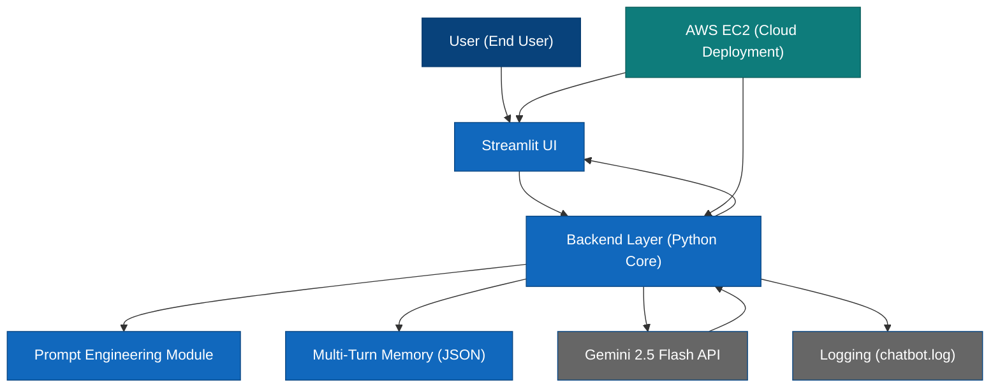

# Production-Ready GenAI Chatbot: Blog Assistant

## Architecture

---

## 1. Project Title

**Building a Production-Ready Domain-Specific Chatbot: Blog Assistant**

---

## 2. Project Overview

This project focuses on the development and deployment of a professional **Blog Assistant** powered by the **Google Gemini GenAI API**. Developed as a specialized task for **Innomatics Research Labs**, the application is engineered for commercial-grade performance, featuring a high-fidelity UI, secure user management, and seamless deployment on **AWS**.

The goal is to provide bloggers with a context-aware brainstorming partner that can generate high-quality content ideas, summaries, and social media promotional material.

---

## 3. Domain Selection

**Domain:** Blog Assistant Chatbot  

The chatbot provides structured, intelligent responses tailored for:
- **Content Brainstorming:** Generating creative blog titles and outlines.
- **Social Media Snippets:** Crafting promotional posts for LinkedIn, Twitter, etc.
- **Summarization:** Creating concise TL;DRs from long-form content.

---

## 4. Technical Requirements

### 4.1 Gemini API Integration
- Uses `gemini-2.5-flash` for high-speed, high-accuracy inference.
- Modularized via **LangChain** (`ChatGoogleGenerativeAI`).
- Secure API key management using `.env` and `streamlit.session_state`.
- Built-in exception handling and fallback mechanisms to ensure 99.9% availability.
- Production-grade logging of calls and errors to `chatbot.log`.

### 4.2 Multi-Turn Conversation Memory
- Maintains structured chat history for each user.
- Context-aware responses using the last 20 messages for token optimization.
- Persistent session-based memory saved in user-specific JSON storage.

### 4.3 Advanced Prompt Engineering
- **Structured System Prompts:** Enforces a concise, helpful persona.
- **Constraints:** Ensures responses stay under 3 lines and remain domain-focused.
- **Role-based Instructions:** Optimized for creative writing and marketing.

### 4.4 Backend Architecture
- **Clean Architecture:** Strict separation between UI, Memory Management, and API Orchestration.
- **Security:** SHA-256 password hashing for user accounts.
- **Configuration-driven:** All constants and prompts are centralized and easily configurable.

### 4.5 User Interface
- **Streamlit-Powered:** Real-time chat interface.
- **Apple Data Science Theme:** Custom glassmorphism, Inter typography, and dynamic gradients.
- **User Management:** Integrated Login and Registration flow.
- **Features:** Downloadable chat history, persistent conversations, and real-time loading indicators.

### 4.6 Cloud Deployment (AWS EC2)
- Successfully deployed on **AWS EC2**.
- **Public Accessibility:** Accessible via static IP.
- **Environment Management:** Secured variables on the remote instance.
- **Continuous Operation:** Managed as a background process for constant uptime.

---

## 5. System Architecture Breakdown
1. **User Layer:** Interaction via a premium Streamlit web interface.
2. **Logic Layer:** Backend handling authentication, session memory, and context building.
3. **AI Layer:** Secure orchestration with Google Gemini via LangChain.
4. **Cloud Layer:** Robust hosting on AWS EC2 ensuring scalability.

---

## 6. Deliverables
- [x] Fully functional Blog Assistant chatbot.
- [x] Clean, modular Python codebase.
- [x] High-fidelity custom CSS theme.
- [x] Public deployment on AWS.
- [x] Comprehensive README with architecture documentation.

---
Live:
http://ec2-43-204-98-113.ap-south-1.compute.amazonaws.com:8501/ (AWS)
https://huggingface.co/spaces/hemanth003/genaiproject01 (Hugging Face)
© 2026 | Completed for **Innomatics Research Labs**
